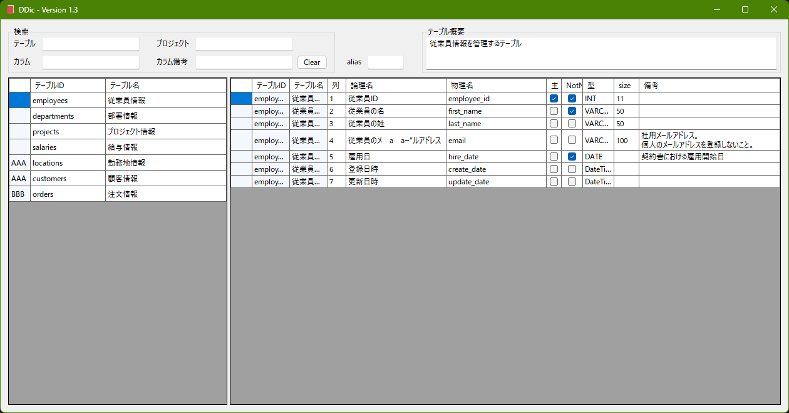

# DDic

## プロジェクト概要
**DDic** は、プロジェクトにおける **テーブル** および **カラム** の情報を管理し、辞書のように参照するためのアプリケーションです。

## 主な機能
- テーブルとカラムの情報を直感的なGUIで表示
- テーブル名やカラム名で検索をサポート
- 該当テーブルのSelect文作成をサポート
- 軽量で使いやすく、個人・商用問わず利用可能

## 使い方


- 画面左上に検索ボックス。テーブル一覧、カラム一覧の検索に使います。
- 左側のGridがテーブル一覧。テーブルを選択するとカラム一覧が表示されます。
- 右側のGridがカラム一覧。項目を確認したり、複数選択してコピーしたり、右クリックからSelect文を作成できます。"alias"に文字列を設定しているとテーブル名のエイリアスとして扱われます。
- 画面右上に選択しているテーブルの概要が表示されます。
- 検索項目は4項目がそれぞれand検索になります。
  - 「テーブル」はテーブルID、テーブル名で絞り込みを行います。
  - 「カラム」は論理名、物理名で絞り込みを行います。
  - 「プロジェクト」はtsvファイル単位での絞り込みを行います。
  - 「カラム備考」はカラム一覧の備考で絞り込みを行います。
  - 検索内容が不要になったらClearで消去します

## インストール
1. releasesから最新のzipをダウンロードし、任意のフォルダに解凍します
2. Resoucesフォルダ内にあるテーブル情報、カラム情報のtsvを編集します。
    ```
    table-.tsv, column-.tsv が基本となるファイルです。
    個別プロジェクトで外付けするテーブルをtable-XXX.tsv、column-XXX.tsvに追加します。
    XXXは任意で設定可能で、プロジェクト名として扱われます。
    個別プロジェクトは何ファイルでも追加可能です。
    ```
3. 必要に応じてconfig.iniを編集します。主に以下の内容が設定できます。
   - 右クリックメニュー項目の表示非表示
   - テーブル一覧、カラム一覧の列の表示非表示
   - Select文作成時に除外するカラム名の指定
4. DDic.exeを起動し、いい感じに使います。
5. 以上

## アンインストール
1. インストールした際の任意のフォルダを削除します。
2. 以上

## その他
- 右クリックからコピーの際、shiftを押していると行列入れ替えてコピー
- 右クリックからSelect文を作る際、shiftを押していると列除外なしでコピー

## License
This project is licensed under the MIT License. See the LICENSE file for details.
